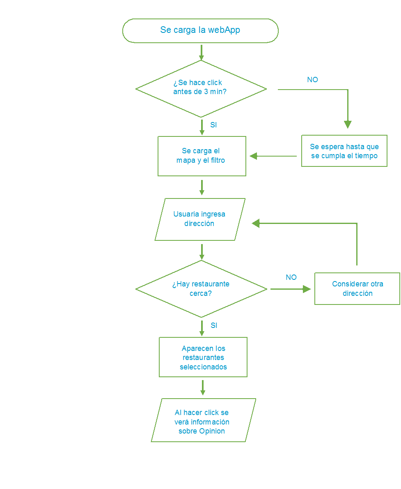

# FOODMAP
Webapp que filtra restaurantes cercanos a la zona donde estés o donde desees buscar. Usa el API de Google Maps

## Desarrollado para
[Laboratoria](http://laboratoria.la)

>**Actualización 5/05/2018**
La plataforma no se puede disfrutar al 100% debido a límites en la cuenta de google platform.

## Flujograma

## Información
> Información sobre funcionalidad de FoodMap
- Se tiene una vista splash que al hacer click dirige a la página restaurant.html. En caso no se realice el click, se redigirá automáticamente en un plazo de 5 segundos. Esto se encuentra en el archivo intro.js.
- Se indicará la lista de distritos disponibles donde funciona FoodMap por ahora.
- Se enlaza el mapa de Google Maps con el API.
- Sólo se verá al inicio la barra de búsqueda, de encontrarse el distrito en la lista, se verá dejabo de esta barra los restaurantes disponibles. En este caso se está poniendo por tipo de restaurante, en vez de nombre de restaurante.
- En la misma información se verá la dirección de estos restaurantes, de esta forma se verifica que se enlazan correctamente, ya que todos los distritos tienen los mismos tipos de restaurantes y quitando las direcciones todos se verían iguales.
- Al hacer click en el restaurante, se observará la opinión de los usarios referente a ese restaurantes. Las opiniones son bad, good y excellent.

## Por Mejorar
- Intenté jalar la ruta de la imagen para ponerla como background pero hasta ahora no se ha podido realizar. Seguiré averiguando.
- Añadir más información sobre los restaurantes.
